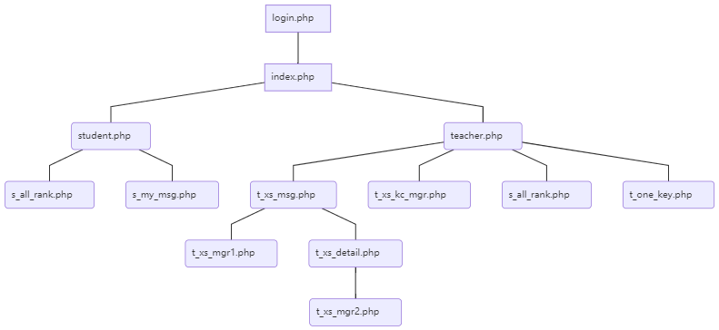
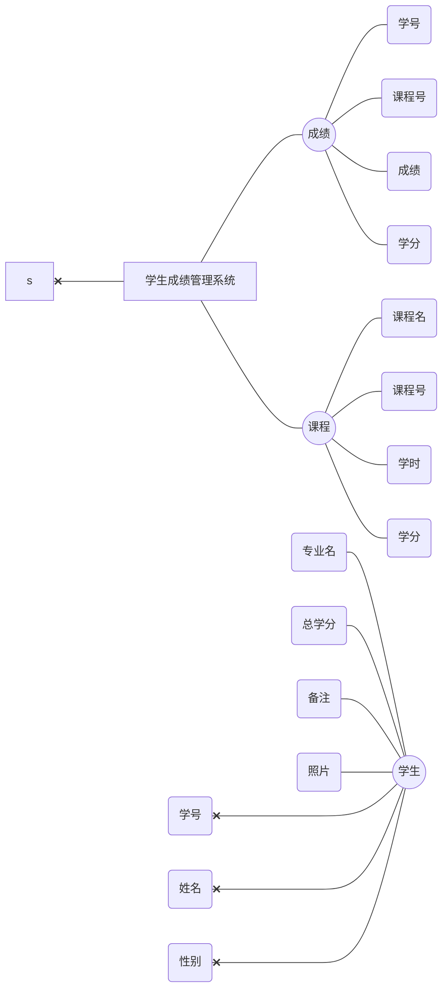
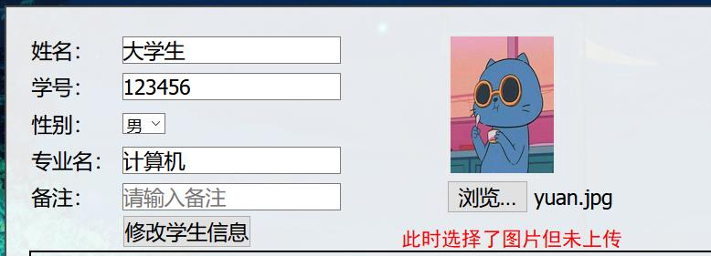
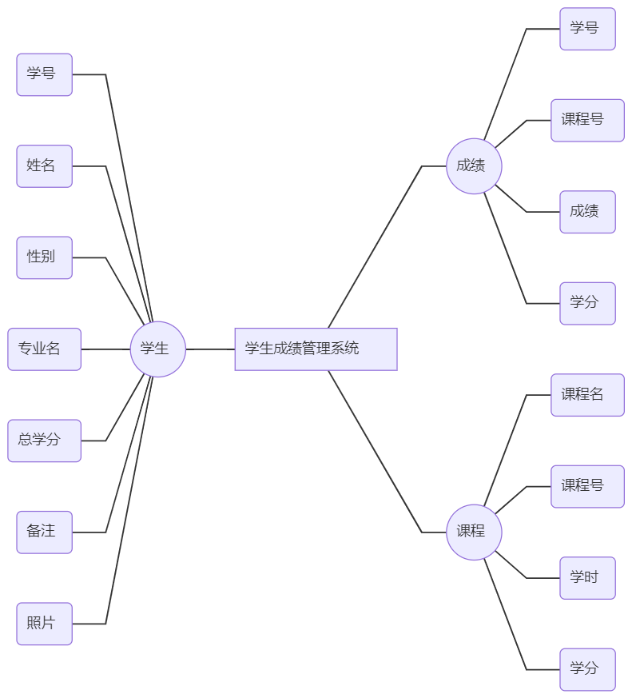

# [PHP]学生成绩管理系统

其实，这是我大一的时候，数据库的课程设计，虽然现在回看也觉得代码凌乱，但也懒得改了，之前是发在了自己搭建的博客，现在发到GitHub上来。

[[PHP]学生成绩管理系统](#php学生成绩管理系统)

* [1 前言](#1-前言)
* [2 功能模块](#2-功能模块)
  * [2.1学生模块](#21学生模块)
  * [2.2 教师模块](#22-教师模块)
  * [2.3 主要的文件结构](#23-主要的文件结构)
* [3 界面设计](#3-界面设计)
  * [3.1 登录界面](#31-登录界面)
  * [3.2 学生主页（我的成绩）](#32-学生主页我的成绩)
  * [3.3 各科成绩](#33-各科成绩)
  * [3.4 教师主页（学生管理）](#34-教师主页学生管理)
  * [3.5 学生信息详情](#35-学生信息详情)
  * [3.6 学生信息修改](#36-学生信息修改)
  * [3.7 添加学生信息](#37-添加学生信息)
  * [3.8 课程管理](#38-课程管理)
  * [3.9 各科成绩](#39-各科成绩)
  * [3.10 一键管理](#310-一键管理)
* [4 数据库设计](#4-数据库设计)
  * [4.1 E-R图](#41-e-r图)
  * [4.2 数据表设计](#42-数据表设计)
  * [4.3 函数创建](#43-函数创建)
  * [4.4 触发器创建](#44-触发器创建)
  * [4.5 关键查询代码](#45-关键查询代码)
    * [4.5.1 查询学生成绩](#451-查询学生成绩)
    * [4.5.2 查询各科成绩](#452-查询各科成绩)
    * [4.5.3 搜索学生](#453-搜索学生)
    * [4.5.4 查询课程平均分](#454-查询课程平均分)
    * [4.5.5 查询课程最高分](#455-查询课程最高分)
    * [4.5.6 查询不及格或优秀的同学](#456-查询不及格或优秀的同学)
* [5 系统特点](#5-系统特点)
  * [5.1 登录](#51-登录)
  * [5.2 界面](#52-界面)
    * [5.2.1 图片预览](#521-图片预览)
    * [5.2.2 html元素动态变化](#522-html元素动态变化)
  * [5.3 文件上传](#53-文件上传)
  * [5.4 成绩排名](#54-成绩排名)
* [6 系统测试](#6-系统测试)
* [7 总结](#7-总结)

## 1 前言

老师要求我们使用php+mysql做一个简单的学生成绩管理系统，并且发了份源代码下来，同时老师的要求也不断地在降低，许多同学也都是修改发的源代码上交。

我认为那份源代码**做工粗糙，功能简单**，仅是修改那份源代码或做成那样，乱敲两下就能完成任务。

因此，我决定独立开发一个我想要的学生成绩管理系统。

## 2 功能模块

本系统主要分为两个模块，分别是学生模块和教师模块

### 2.1学生模块

| 序号 | 模块     | 功能     | 描述                             |
| ---- | -------- | -------- | -------------------------------- |
| 1    | 用户登录 | 登录     | 输入用户名和密码进入系统主页     |
| 2    | 系统主页 | 划分模块 | 分为学生主页和教师主页           |
|      |          |          |                                  |
| 3    | 我的成绩 | 成绩查询 | 查询我的考试成绩                 |
| 4    | 各科排名 | 成绩查询 | 查询所有人的各个科目的成绩和排名 |

### 2.2 教师模块

| 序号 | 模块     | 功能           | 描述                                                       |
| ---- | -------- | -------------- | ---------------------------------------------------------- |
| 1    | 用户登录 | 登录           | 输入用户名和密码进入系统主页                               |
| 2    | 系统主页 | 划分模块       | 分为学生主页和教师主页                                     |
|      |          |                |                                                            |
| 3    | 学生管理 | 成绩和信息管理 |                                                            |
| 4    | 课程管理 | 课程管理       | 对课程进行增删改查                                         |
| 5    | 各科成绩 | 成绩查询       | 查询所有人的各个科目的成绩和排名                           |
| 6    | 一键管理 | 便捷查询       | 关键词搜索学生，一键查询平均分，最高分，不及格，优秀的学生 |

### 2.3 主要的文件结构



## 3 界面设计

### 3.1 登录界面

.jpg)

<center>图1-登录界面</center>

### 3.2 学生主页（我的成绩）

.jpg)

<center>图2-学生主页</center>

### 3.3 各科成绩

.jpg)

<center>图3-各科成绩</center>

### 3.4 教师主页（学生管理）

.jpg)

<center>图4-教师主页</center>

### 3.5 学生信息详情

.jpg)

<center>图5-学生信息详情</center>

### 3.6 学生信息修改

.jpg)

<center>图6-学生信息修改</center>

### 3.7 添加学生信息

.jpg)

<center>图7-添加学生信息</center>

### 3.8 课程管理

.jpg)

<center>图8-课程管理</center>

### 3.9 各科成绩

.jpg)

<center>图9-各科成绩</center>

### 3.10 一键管理

.jpg)

<center>图10-一键管理</center>

## 4 数据库设计

主要包括E-R图设计、数据表设计、函数创建、触发器创建和关键查询代码。

### 4.1 E-R图



### 4.2 数据表设计

本系统用到3个表，用户表、学生表、成绩表、课程表。

---

用户表：user，结构如下所示

| 列名     | 数据类型 | 说明             |
| -------- | -------- | ---------------- |
| id       | int      | 主键，升序       |
| username | char(20) | 用户名           |
| password | char(20) | 密码             |
| power    | int      | 0为学生，1为教师 |

学生表：student，结构如下所示

| 列名   | 数据类型 | 说明                                 |
| ------ | -------- | ------------------------------------ |
| 学号   | char(8)  | 主键                                 |
| 姓名   | char(8)  |                                      |
| 性别   | char(2)  |                                      |
| 专业名 | char(10) |                                      |
| 总学分 | int      | 可空                                 |
| 备注   | text     | 可空                                 |
| 照片   | text     | 可空，上传照片时，储存照片的相对路径 |

成绩表：cj，结构如下所示

| 列名   | 数据类型 | 说明 |
| ------ | -------- | ---- |
| 学号   | char(8)  | 主键 |
| 课程号 | char(3)  | 主键 |
| 成绩   | int      |      |
| 学分   | int      |      |

课程表：kc，结构如下所示

| 列名   | 数据类型 | 说明 |
| ------ | -------- | ---- |
| 课程号 | char(3)  | 主键 |
| 课程名 | char(20) |      |
| 学时   | int      |      |
| 学分   | int      |      |

### 4.3 函数创建

返回某学生某科的成绩排名的函数

```mysql
delimiter $$
create funtion my_cj_one (num char(8),subject char(8))
returns int
begin
return(
select 排名
from
(
select 学号,课程号,课程名,学分,成绩,排名
from (
select 学号,课程号,课程名,学分,成绩,@currank := @currank+1 as 排名
from 
(select 学号,课程号,kc.课程名,cj.学分,成绩
from cj
join kc
using(课程号)
where 课程名=subject
order by 成绩 desc) a
join (select @currank := 0 ) q
order by 成绩 desc) b
where 学号=num
) c
);
end$$
delimiter ;
```

例如，查询王林的计算机基础的成绩，在所有人中的排名

```mysql
select 姓名,my_cj_one('081101','计算机基础') from student
where 学号='081101';
```

.jpg)

### 4.4 触发器创建

当删除表student中某个学生的信息时，同时也删除cj表中该学生的全部数据。

```mysql
delimiter $$
create trigger xs_delete after delete
	on student for each row
begin
	delete from cj where 学号=old.学号;
end$$
delimiter ;
```

### 4.5 关键查询代码

比较普通的查询语句就不作赘述，下面只列出较为关键的语句。

#### 4.5.1 查询学生成绩

在s_my_msg.php中

`$num`表示某学生的学号，通过php中取cookies方式获取

```mysql
SELECT 姓名,学号,课程号,课程名,kc.学分,成绩,my_cj_one('$num',课程名) as 排名
FROM cj join kc using(课程号) join student using(学号)
WHERE 学号='$num';
```

#### 4.5.2 查询各科成绩

在s_all_rank.php中

`$_kcm`表示某课程的名称，通过php中GET方式获取

```mysql
select 学号,姓名,课程号,课程名,学分,成绩,排名
from(
select 学号,课程号,课程名,学分,成绩,@currank := @currank+1 as 排名
from 
(select 学号,课程号,kc.课程名,cj.学分,成绩
from cj
join kc
using(课程号)
where 课程名='$_kcm'
order by 成绩 desc) a
join (select @currank := 0 ) q
) b
join student
using(学号);
```

#### 4.5.3 搜索学生

在t_one_key.php中

`$words`表示搜索输入的关键词，通过php中POST方式获取

```mysql
select * from student 
where 学号 like'%$words%'
or 姓名 like'%$words%'；
```

#### 4.5.4 查询课程平均分

在t_one_key.php中

```mysql
select 课程名,课程号,avg(成绩) as 平均成绩 from cj
join kc using(课程号) group by 课程号;
```

#### 4.5.5 查询课程最高分

在t_one_key.php中

```mysql
#查询所有课程的最高分
select 课程名,课程号,姓名,学号,成绩 from cj as T1
join student using(学号)
join kc using(课程号)
where not exists
(select 1 from cj where 课程号=T1.课程号 and 成绩>T1.成绩);

#查询某课程的最高分
select 学号,课程号,成绩 from cj
where 成绩 in 
(select min(成绩) from cj where 课程号='某科的课程号');
```

#### 4.5.6 查询不及格或优秀的同学

在t_one_key.php中

```mysql
select 课程名,课程号,姓名,学号,成绩 from cj
join student using(学号)
join kc using(课程号)
where 成绩<60;
#将成绩<60，修改为成绩>90即为优秀
```

## 5 系统特点

### 5.1 登录

在登录界面输入用户名和密码之后，在后端验证是否正确，且判断该用户的权限，根据用户权限进入不同的页面，如教师则进入教师页面，学生则进去学生页面。

登录之后会在用户的计算机上留下cookies信息，时效为一个小时，如果用户在一个小时内，使用该系统后没有退出，则下次进入该系统的时候，就不用再次登录。

每个页面都会验证cookeis信息，只有登录了的用户才能使用该系统，否则页面会跳转到登录页面。

相关代码：

```php
//cookies.php中
//登录时验证
if(!isset($_COOKIE['admin'])){
	//没有cookie登录
	if(isset($_POST['username']) && isset($_POST['password'])){
		$uname=$_POST["username"];
		$password=$_POST["password"];
		$sql="select username,password from user where
		username='$uname' and password='$password'";
		
		mysql_select_db($database_login, $login);
		$result = mysql_query($sql,$login);
		$row = mysql_fetch_assoc($result);
		$cookee=$row["username"];
        
		if ($row) {
			setcookie("admin",$cookee,time()+3600,'/');
			echo"
			<script>url=\"../index.php\";
			window.location.href=url;</script>";	
		} else {
			echo"<script>alert(\"登录失败！\");</script>";
			echo"
			<script>url=\"../login.php\";
			window.location.href=url;</script>";
		}
	}
}
else
{
//有cookies
			echo"
			<script>url=\"../index.php\";
			window.location.href=url;</script>";
		}		
}
?>
```

用户点击“安全退出”时，删除cookeis信息

```php
//exit.php中
//删除cookies
setcookie("admin","",time()-3600,'/');
echo"<script>url=\"../login.php\";window.location.href=url;</script>";

```

每个页面都包含该代码，防止用户未登录则使用该系统

```php
//is_login.php中
if(isset($_COOKIE['admin'])){
	//防止用户查看页面各个子页面
	$headers = apache_request_headers();
	if(strstr($_SERVER["PHP_SELF"],"t_") or strstr($_SERVER["PHP_SELF"],"s_")){
		if(!strstr($headers["Referer"],$_SERVER['HTTP_HOST'])){
			echo "<script>
		window.location.href=\"../../index.php\";</script>";
		}
	}
	elseif (strstr($_SERVER["PHP_SELF"],"teacher.php") or strstr($_SERVER["PHP_SELF"],"student.php")){
		if(!strstr($headers["Referer"],$_SERVER['HTTP_HOST'])){
			echo "<script>
		window.location.href=\"../index.php\";</script>";
		}
	}
}
else{
	//防止用户未登录则使用该系统
	if(strstr($_SERVER["PHP_SELF"],"t_") or strstr($_SERVER["PHP_SELF"],"s_")){
		echo "<script>alert(\"请先登录!\");
		window.location.href=\"../../login.php\";</script>";	
	}
	elseif (strstr($_SERVER["PHP_SELF"],"teacher.php") or strstr($_SERVER["PHP_SELF"],"student.php")){
		echo "<script>alert(\"请先登录!\");
		window.location.href=\"../login.php\";</script>";	
	}
	else {
		echo "<script>alert(\"请先登录!\");
		window.location.href=\"login.php\";</script>";	
	}
}
```

### 5.2 界面

界面设计的细节主要使用JavaScript来实现。

#### 5.2.1 图片预览

例如，上传照片前的图片预览，而老师发的源代码并不能预览



此时选择了图片但未上传，就能预览该图片

相关代码：

``` javascript
// 获取图片预览地址函数
function getObjectURL(file) {  
	var url = null;   
	if (window.createObjectURL!=undefined) {  
		url = window.createObjectURL(file) ;  
	} else if (window.URL!=undefined) { // mozilla(firefox)  
		url = window.URL.createObjectURL(file) ;  
	} else if (window.webkitURL!=undefined) { // webkit or chrome  
		url = window.webkitURL.createObjectURL(file) ;  
	}  
	return url ;  
}
function uploader(e){
	// 将图片信息通过getObjectURL函数处理出预览地址
	var s = getObjectURL(e[0]);
	// 获取img元素，label元素，div[上传按钮]元素
	var img=document.getElementById('o_photo_img');
	// 设置图片展示样式
	img.style.padding='3px';
	img.style.borderStyle='solid';
	img.style.borderColor='#eee';
	img.style.borderWidth='1px';
	// 设置img的src值实现图片预览
	img.src=s;
}
```

#### 5.2.2 html元素动态变化

利用JS的DOM来对html的元素进行操作。

例如，学生成绩的修改，和课程管理。

以学生成绩的修改为例，不多说，见下图。



相关代码：

``` javascript
//鼠标点击标签时，找到是第几个标签
//实现精准修改某课程的成绩
onload = function() {
    var lis = document.getElementsByClassName("xiugai");
    var funny = function(i){
		lis[i].onclick = function(){
        //alert("第" + (i+1) + "个");
		update(i);
        }
    }
    for(var i=0;i<lis.length;i++){
		funny(i);
    }
}
```

点击按钮时的相关函数：

``` javascript
//获取option元素的值
function display(idname,optionNA){
   var all_options = document.getElementById(idname).options;
   for (i=0; i<all_options.length; i++){
      if (all_options[i].className == optionNA) 
      {
         all_options[i].selected = true;
      }
   }
};
//当选择option元素而onchange事件时的函数
//显示选中课程的课程号和学分
function xuanze(){
	var text=document.getElementById("sel").value;
	display("kch0",text);
	display("xf0",text);
    
	document.getElementById("kch").innerHTML=document.getElementById("kch0").value;
	document.getElementById("xf").innerHTML=document.getElementById("xf0").value;
	document.getElementById("kch_t").value=document.getElementById("kch").innerHTML;
	document.getElementById("xf_t").value=document.getElementById("xf").innerHTML;
}
//点击按钮添加成绩时，动态增加html元素，因为需要获取课程名称，所以结合php代码
function add() {
    var d=document.createElement('div');
    var o=document.getElementById('查询框');
	var f=document.createElement('form');
	var u=document.createElement('ul');
	
	var li1=document.createElement('li');
	var li2=document.createElement('li');
	var li3=document.createElement('li');
	var li4=document.createElement('li');
	var li5=document.createElement('li');
	var li6=document.createElement('li');
	var li7=document.createElement('li');
	var li8=document.createElement('li');
	var li9=document.createElement('li');
	var li_=document.createElement('li');
	
	var i1=document.createElement('p');
	var i2=document.createElement('p');
	var i3=document.createElement('p');
	var i4=document.createElement('select');
	var i5=document.createElement('p');
	var i6=document.createElement('input');
	var i7=document.createElement('input');
	
	var i_=document.createElement('p');
	var i8=document.createElement('input');
	var i9=document.createElement('input');
	var ok=document.createElement('input');
	
	var s1=document.getElementById('kch0');
	var s2=document.getElementById('xf0');
	var op=new Array();
	var op1=new Array();
	var op2=new Array();
	var op_p=0;
	
	d.setAttribute("class","list1");
	ok.setAttribute("type","submit");
	ok.setAttribute("name","add");
	ok.setAttribute("value","添加成绩");
	
	i2.innerHTML="<?php echo $row_stu_msg['姓名'];?>";
	//i2.innerHTML="<?php echo $row_stu_msg['学号'];?>";
	
	i3.setAttribute("id","kch");
	i3.innerHTML="请选择课程";
	//--------
	i4.setAttribute("id","sel");
	i4.setAttribute("onchange","xuanze()");
	var t=document.createElement('option');
	t.innerHTML="请选择课程";
	i4.appendChild(t);
	<?php do { ?>
	op.push(document.createElement('option'));
	op[op_p].setAttribute("value","<?php echo $row_Recordset1['课程名']; ?>");
	op[op_p].setAttribute("class","<?php echo $row_Recordset1['课程名']; ?>");
	op[op_p].innerHTML="<?php echo $row_Recordset1['课程名']; ?>";
	i4.appendChild(op[op_p]);
	//op_p++;
	//-----
	op1.push(document.createElement('option'));
	op1[op_p].setAttribute("value","<?php echo $row_Recordset1['课程号']; ?>");
	op1[op_p].setAttribute("class","<?php echo $row_Recordset1['课程名']; ?>");
	op1[op_p].innerHTML="<?php echo $row_Recordset1['课程号']; ?>";
	s1.appendChild(op1[op_p]);
	//---
	op2.push(document.createElement('option'));
	op2[op_p].setAttribute("value","<?php echo $row_Recordset1['学分']; ?>");
	op2[op_p].setAttribute("class","<?php echo $row_Recordset1['课程名']; ?>");
	op2[op_p].innerHTML="<?php echo $row_Recordset1['学分']; ?>";
	s2.appendChild(op2[op_p]);
	op_p++;
	
	<?php } while ($row_Recordset1 = mysql_fetch_assoc($Recordset1)); ?>
	//---------
	i5.setAttribute("id","xf");
	i5.innerHTML="请选择课程";
	
	i6.setAttribute("type","text");
	i6.setAttribute("name","cj");
	i6.setAttribute("placeholder","请输入成绩");
	
	
	i8.setAttribute("name","kch");
	i9.setAttribute("name","xf");
	i8.setAttribute("id","kch_t");
	i9.setAttribute("id","xf_t");
	i8.setAttribute("hidden","");
	i9.setAttribute("hidden","");
	
	f.setAttribute("method","post");
	f.setAttribute("action","");
	
	u.appendChild(li2);
	li2.appendChild(i2);
	u.appendChild(li3);
	li3.appendChild(i3);
	u.appendChild(li4);
	li4.appendChild(i4);
	u.appendChild(li5);
	li5.appendChild(i5);
	
	u.appendChild(li6);
	li6.appendChild(i6);
	
	i_.innerHTML="&nbsp;";
	u.appendChild(li_);
	li_.appendChild(i_);
	u.appendChild(li7);
	li7.appendChild(ok);
	
	u.appendChild(li8);
	li8.appendChild(i8);
	u.appendChild(li9);
	li9.appendChild(i9);
	
	f.appendChild(u);
	d.appendChild(f);
    o.appendChild(d);
	document.getElementById('add1').setAttribute("hidden","");
	document.getElementsByClassName('list2')[0].setAttribute("hidden","");
  }
//点击修改成绩时，动态变换html元素
function update(i) {
	var c=document.getElementsByClassName('list1')[i].children[0].children[4];
	var text=document.getElementsByClassName('list1')[i].children[0].children[4].innerHTML;
  
	var cc=c.childNodes[0];
	var ok=document.createElement('input');
	ok.setAttribute("type","text");
	ok.setAttribute("name","cj");
	ok.setAttribute("value",text);
	c.replaceChild(ok,cc);
	//------
	var c=document.getElementsByClassName('list1')[i].children[0].children[6];
  
	var cc=c.children[0];
	var zong=document.createElement('span');
	var ok=document.createElement('input');
	ok.setAttribute("type","button");
	ok.setAttribute("name","tijiao");
	ok.setAttribute("value","确定");
	var de=document.createElement('input');
	de.setAttribute("type","button");
	de.setAttribute("name","shanchu");
	de.setAttribute("value","删除");
	var k=document.createTextNode(" ");
	zong.appendChild(ok);
	zong.appendChild(k);
	zong.appendChild(de);
	c.replaceChild(zong,cc);
	var v="transfer("+i+",1)";
	ok.setAttribute("onclick",v);
	var v="transfer("+i+",0)";
	de.setAttribute("onclick",v);
}
//确定修改成绩或删除成绩时，将内容传递到隐藏的表单内
function transfer(i,cmd) {
	var text=document.getElementsByClassName('list1')[i].children[0].children[4].childNodes[0].value;
	document.getElementById('cj').setAttribute("value",text);
	 var text=document.getElementsByClassName('list1')[i].children[0].children[1].innerHTML;
	document.getElementById('kch').setAttribute("value",text);
	document.getElementById('cmd').setAttribute("value",cmd);
	//document.getElementById('up').submit();
	if(cmd=='0'){
	  var r=confirm("确定删除？");
	  if (r == true) {
		  document.getElementById('submit0').click();
		  } 
	}
	if(cmd=='1'){
		var r=confirm("确定修改？");
		if (r == true) {
		  document.getElementById('submit0').click();
		  } 
	}
}
```

### 5.3 文件上传

本来是没有这个功能的，当我尝试使用将图片以二进制文件存储到数据库的方法时，发现图片能存入数据库，该图片也能查看，但是却无法在网页中显示，因为解决不能该显示图片的问题，所以我尝试通过上传文件（图片）的方式，将图片存储到该管理系统的某目录下，而数据库中则存储该路径的文本信息，网页显示图片时，图片只需要链接到该路径即可。

该功能主要利用表单提交数据和php后端代码实现。

相关代码：

获取表单提交的图片，并将其存储到某目录下：

```php
//限制上传的文件为图片
$allowedExts = array("gif", "jpeg", "jpg", "png");
$temp = explode(".", $_FILES["file"]["name"]);
//echo $_FILES["file"]["size"];
$extension = end($temp);     // 获取文件后缀名
if ((($_FILES["file"]["type"] == "image/gif")
|| ($_FILES["file"]["type"] == "image/jpeg")
|| ($_FILES["file"]["type"] == "image/jpg")
|| ($_FILES["file"]["type"] == "image/pjpeg")
|| ($_FILES["file"]["type"] == "image/x-png")
|| ($_FILES["file"]["type"] == "image/png"))
&& ($_FILES["file"]["size"] < 2048000)   //限制图片小于2mb
&& in_array($extension, $allowedExts))
{
    if ($_FILES["file"]["error"] > 0)
    {
        echo "错误：: " . $_FILES["file"]["error"] . "<br>";
    }
    else
    {
        // 判断当前目录下的 upload 目录是否存在该文件
        if (file_exists("../../upload/" . $_FILES["file"]["name"]))
        {
            //echo $_FILES["file"]["name"] . " 文件已经存在。 ";
            //就继续使用原来的文件
        }
        else
        {
            // 如果 upload 目录不存在该文件则将文件上传到 upload 目录下
            move_uploaded_file($_FILES["file"]["tmp_name"], "../../upload/" . $_FILES["file"]["name"]);
        }
    }
}
```

获取该图片的路径：

```php
//取得上传后的图片的相对路径，可将其拼接到对应的SQL语句
$zpn=$_FILES["file"]["name"];
$zp=sprintf("%s%s/%s",dirname(dirname(dirname($_SERVER["PHP_SELF"]))),"/upload",$zpn); 
```

### 5.4 成绩排名

该功能主要是通过构造SQL查询语句实现。

如果是在一张表中，对该表的成绩进行排名，那很容易，用如下的基础代码即可实现。

```mysql
select 学号,成绩,@currank := @currank +1 as 排名
from cj,(select @currank :=0) q
order by 成绩;
```

但问题来了，cj表中只有课程号，学号和成绩，没有姓名和课程名，如果要获取姓名和课程名，这个时候就需要多表连接了。

可是问题又来了，直接使用多表连接之后，排名根本就是乱的，不是正确的排名。

如果仅要查询某学生在某课程中的排名呢？并且加上查询姓名和课程名呢？

于是，我想到了子查询，通过各种尝试后，最后构造了一个函数：

```mysql
delimiter $$
create funtion my_cj_one (num char(8),subject char(8))
returns int
begin
return(
select 排名
from
(
select 学号,课程号,课程名,学分,成绩,排名
from (
select 学号,课程号,课程名,学分,成绩,@currank := @currank+1 as 排名
from 
(select 学号,课程号,kc.课程名,cj.学分,成绩
from cj join kc
using(课程号)
where 课程名=subject
order by 成绩 desc) a
join (select @currank := 0 ) q
order by 成绩 desc) b
where 学号=num
) c
);
end$$
delimiter ;
```

执行该函数便可得到某学生某课程的成绩排名，如果要加上姓名和课程名，只需要多表连接即可，例如：

```mysql
SELECT 姓名,学号,课程号,课程名,kc.学分,成绩,my_cj_one('$num',课程名) as 排名
FROM cj join kc using(课程号) join student using(学号)
WHERE 学号='$num';
```

---

其他相对普通的功能和代码就不展示了，可以在源代码中查看。

## 6 系统测试

测试系统：Windows10

测试浏览器：Firefox

---

服务系统：Windows7

服务环境：

- apache2.4.39
- php5.4.45nts
- mysql5.7.26

---

各个功能模块测试通过。

测试详情见视频。

## 7 总结

尽管之前没学过JS和PHP，但边学边做，修修补补，面向百度编程。

开发的途中，虽几经波折，但总有收获，不仅复习了MYSQL的知识，也掌握了PHP和JS的基础知识，实现了自己想要的功能和细节，最后完成了自认为较为理想的成绩管理系统，尽管它代码冗杂，还有许多可以改进的地方，希望能再接再厉。

可能还有各种细节的问题或逻辑的问题，请多多指教。

GitHub链接：[https://github.com/teemo-s/xscj-system/](https://github.com/teemo-s/xscj-system/)

